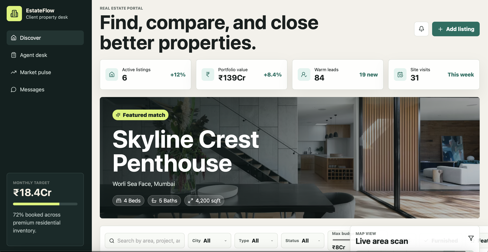

# EstateFlow Real Estate Portal

EstateFlow is a MERN real estate portal for property discovery, lead handling, shortlist comparison, and agent-side follow-up. It includes a polished React dashboard, an Express API, MongoDB models, and bundled sample listings so the app works immediately.



## Features

- Interactive property listings with images, prices, amenities, and agent details.
- Advanced filters for city, property type, sale/rent status, budget, bedrooms, featured listings, and furnished listings.
- Map-style listing discovery with clickable property markers.
- Saved shortlist for comparing client favorites.
- Lead inquiry form connected to the backend API.
- Agent dashboard cards for active listings, portfolio value, warm leads, site visits, and sales pipeline status.
- MongoDB-ready backend with sample-data fallback when no database is configured.

## Tech Stack

- React + Vite
- Express.js
- MongoDB + Mongoose
- Node.js
- Responsive CSS

## Project Structure

```text
.
├── client/          React frontend
├── server/          Express API and MongoDB models
├── docs/            README images and project assets
├── package.json     Root scripts for running both apps
└── README.md
```

## Run Locally

Install dependencies from the project root:

```bash
npm run install:all
```

Start the frontend and backend together:

```bash
npm run dev
```

Open the app:

```text
Frontend: http://localhost:5173
API:      http://localhost:5001/api
```

## How To Use

Use the left sidebar to move between the discovery view, agent desk, market pulse, and messages. The main dashboard starts with portfolio metrics and a featured property preview.

Search and filter listings from the filter bar below the hero property. You can filter by city, type, status, max budget, minimum bedrooms, furnished listings, and featured properties.

Click any listing card or map marker to make it the active property. The right panel updates with map context, assigned agent details, lead form, and saved shortlist.

Use the heart button on a listing to save it to the shortlist. This helps compare properties for a client before sharing recommendations.

Use the inquiry form in the agent panel to capture a lead. If MongoDB is not configured, the API still responds using bundled sample data.

## MongoDB Setup

The app runs without MongoDB by using sample listings. To connect a database, create `server/.env`:

```bash
PORT=5001
MONGO_URI=mongodb://127.0.0.1:27017/estateflow
CLIENT_ORIGIN=http://localhost:5173
```

Seed MongoDB with the bundled listings:

```bash
npm --prefix server run seed
```

Then restart the dev server:

```bash
npm run dev
```

## Useful Scripts

```bash
npm run dev          # Run client and server together
npm run build        # Build the React frontend
npm run start        # Start the Express server
npm run install:all  # Install root, client, and server dependencies
```
